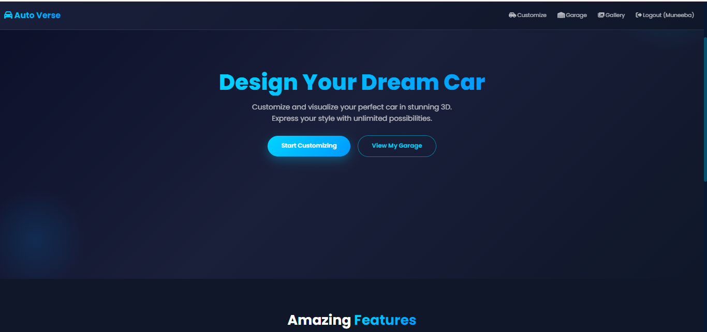
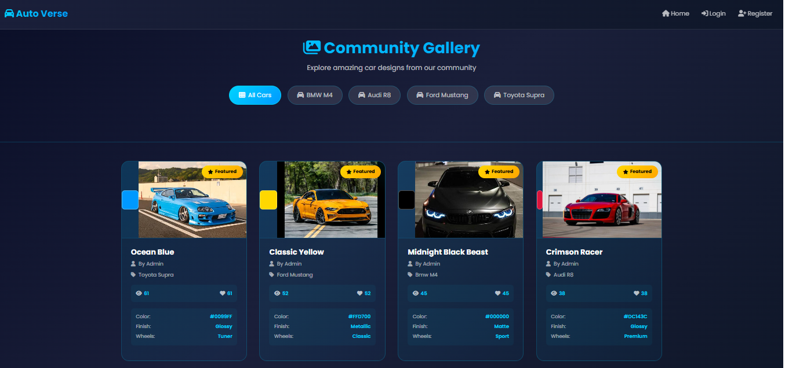
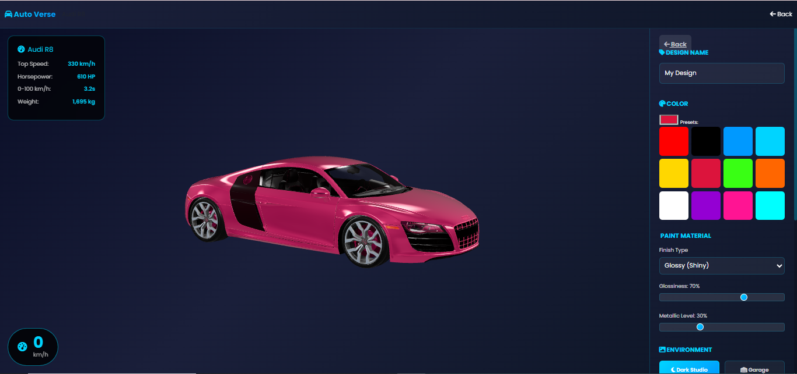

# 🚗 Auto Verse - 3D Car Customization Studio

**Auto Verse** is an interactive web-based platform that allows users to visualize and customize 3D car models in real-time. Built to solve the problem of costly and irreversible physical car modifications, it lets enthusiasts experiment with colors, paint finishes, and environments virtually before making real-world decisions.

## ✨ Key Features
*   ** Real-Time 3D Customization:** Change body colors, paint finishes (glossy, matte, metallic), and background environments instantly using Google's Model Viewer.
*   **🏎️ Multiple Car Models:** Choose from high-quality 3D models like BMW M4, Audi R8, Ford Mustang, and Toyota Supra.
*   **🔒 User Authentication & Garage:** Secure login system where users can save their custom designs to a personal virtual garage.
*   ** Community Gallery:** Browse and get inspired by featured designs created by other users.

## 🛠️ Tech Stack
*   **Backend:** Python Flask
*   **Frontend:** HTML5, CSS3, JavaScript (Bootstrap 5)
*   **Database:** SQLite (via SQLAlchemy ORM)
*   **3D Rendering:** Google Model Viewer (GLB files)

##  How to Run Locally
1. Clone the repository.
2. Navigate to the project folder and install dependencies.
3. Run the application using Python.

   
   
   

---
*Built by Muneeba Wadood as part of the Software Construction and Development (SCD) course.*
